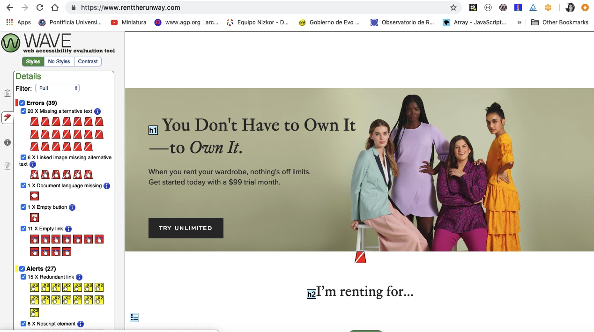

## Description
My project is focused on web accessibility (a11y for short). Based on a conversation with a former colleague who worked towards a settlement on behalf of Disability Rights Advocates to bring accessible web formats for blind voters registering to vote online and my interest in 508 compliance, I wanted to learn as much as I could about the topic to with the ultimate goal of building out a fully accessible site about accessibility. 

The problem: When talking to fellow developers about accessibility, some had heard about it but were daunted by the process of understanding the legal jargon of WCAG 2.1 in order to build accessible websites. 

The solution: A starting point/toolkit for developers. Take the time to research and test out tools/resources and then build something that is more digestable and approachable for developers to see how easy and simple building accessible sites can be. 

The user/target audience: The uninformed and "unaffected" web developer.
 
## The Planning Stages
I spent the majority of project week following tutorials, reading the WCAG Guidelines, testing companies' websites and practicing how to implement accesibility through coding exercises. (see planning folder for details). I then built out MVP, Silver and Gold Plans for building something to help make accessibility accessible to developers. (see schedule.md for details). 

## Brief Example
Ran Wave tool on Rent the Runway's site to show the many violations that made the site inaccessible. 

## Lighthouse Test Results
Ran tests on a handful of sites of companies I am interested in and generated reports showing data points like accessibility and SEO. See Lighthouse Test Results folder. In addition to generating reports, I began using the universal design template of Gatsbyjs, which includes a lighthouse plugin for testing accessibility of site as you build. 

## List of Features / User Stories
This typically will be a short list of the features / user stories that you planned during the development phase of the project
To provide more detail, you can show how you categorized these features into Bronze (MVP), Silver, and Gold Levels and indicate which features you complete / have yet to complete

## List of Technologies Used

* gatsbyjs
*  "devDependencies": {
    "eslint-config-airbnb": "^17.1.0",
    "eslint-plugin-import": "^2.16.0",
    "eslint-plugin-jsx-a11y": "^6.2.1",
    "eslint-plugin-react": "^7.12.4",
    "git-scripts": "latest",
    "prettier": "^1.16.4",
    "surge": "latest"
* react-a11y
* Wave
* Lighthouse
* Chrome Vox

## Unsolved Issues 
Current status: Working with Jaime, UX Designer, to build out wireframes for well-designed, accessible site. Will continue to update changes as we build out the site. See schedule for latest updates/plan. 
